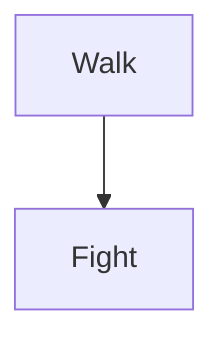

# Documentation

Time cost:

- Walking speed: 3 m/s
- Walk distance between monsters: 30 m
- Walking time: 10 s
- Fighting time: Dynamic

Unit:

- HP
- HP regeneration
- Strength
- Agility
- Intelligence
- Armor
- Mana
- Mana regeneration
- Base damage
- XP
- Level
- Gold
- Inventory
  - Equipment
- Skills
  - Skill